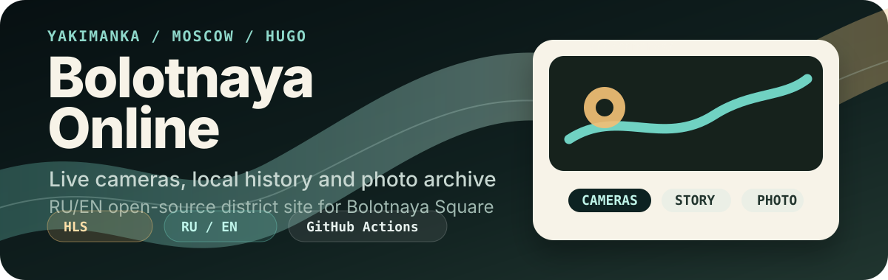

<p align="center">
  
</p>

<p align="center">
  <a href="https://bolotnaya.online/">Site</a> ·
  <a href="https://bolotnaya.online/ru/cameras/">Cameras</a> ·
  <a href="https://bolotnaya.online/ru/history/">History</a> ·
  <a href="https://github.com/A-Krivoshen/bolotnaya/actions/workflows/hugo-build-archive.yml">Deploy workflow</a>
</p>

<p align="center">
  
  
  
  
</p>

# Bolotnaya Online

Independent open-source district site about **Bolotnaya Square** and **Yakimanka** in Moscow. It combines public HLS camera pages, local history, photo galleries, blog notes, and a bilingual Hugo build published to GitHub Pages.

The live cameras may be temporarily offline during facade maintenance. Status notes live in the blog so the site does not pretend streams are always available.

## What Is Inside

| Area | Purpose |
| --- | --- |
| `content/ru` and `content/en` | Russian default content and English version |
| `layouts/` | Project-specific Hugo templates on top of PaperMod |
| `assets/css/extended/` | Extended theme styles and responsive polish |
| `static/` | Public static files, root 404 fallback, icons, robots, camera placeholders, AI briefs |
| `.github/workflows/hugo-build-archive.yml` | Hugo build, artifact upload, and deploy to `gh-pages` |

## Highlights

- Bilingual Hugo site with Russian as the default language under `/ru/`.
- Dedicated pages for live camera streams, history, galleries, posts, support, terms, and partner info.
- Custom templates and CSS for a more local editorial feel than a stock theme.
- GitHub Actions deployment using Hugo Extended and `peaceiris/actions-gh-pages`.
- Working root `404.html` fallback for GitHub Pages.

## Local Development

```bash
git submodule update --init --recursive
npm install
hugo server -D
```

Hugo Extended `0.158.0+` is required by the templates. CI currently builds with Hugo `0.163.3`.

## Production Build

```bash
HUGO_ENV=production hugo --minify --gc --baseURL "https://bolotnaya.online/"
```

The build output goes to `public/`. On `main`, GitHub Actions uploads that folder as an artifact and publishes it to the `gh-pages` branch with the `bolotnaya.online` CNAME.

## Useful Links

- Production: <https://bolotnaya.online/>
- Russian home: <https://bolotnaya.online/ru/>
- English home: <https://bolotnaya.online/en/>
- AI brief: <https://bolotnaya.online/llms.txt>

## License

Content and code ownership stays with the project author unless noted otherwise in source files.
